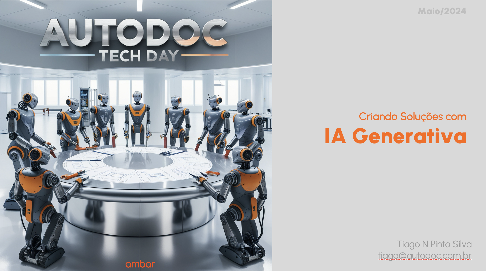

# Criando Soluções com IA Generativa

> Material de apoio da apresentação "Criando Soluções com IA Generativa" ministrada por Tiago N Pinto Silva no Autodoc Tech Day em Maio/2024.

## 📋 Sobre este repositório

Este repositório contém recursos, códigos de exemplo e materiais de referência relacionados à implementação de soluções utilizando Inteligência Artificial Generativa (GenAI), com foco em aplicações práticas para o setor de tecnologia e negócios.

## 🧠 Conceitos abordados

### Fundamentos de IA

- **IA**: Sistemas que executam tarefas específicas com base em dados e algoritmos, como análise preditiva, classificação ou reconhecimento de padrões
- **Machine Learning**: Algoritmos que aprendem e melhoram com dados
- **Deep Learning**: Redes neurais profundas que analisam dados complexos (imagem, voz, linguagem natural)
- **GenAI**: Um tipo de IA focado em gerar novos conteúdos
- **LLMs** (Large Language Models): Modelos de Machine Learning treinados em grandes quantidades de texto para entender e gerar linguagem natural

### Foundation Models

Modelos de Machine Learning treinados em grandes volumes de dados e projetados para serem adaptáveis a diversas tarefas. Diferente dos modelos tradicionais de ML que são treinados para tarefas específicas, os Foundation Models são:

- Massive multi-tasking models
- Adaptáveis com pouco ou nenhum treinamento adicional
- Pré-treinados com aprendizado não-supervisionado

## 🛠️ Técnicas e Ferramentas

### Prompt Engineering

Métodos para otimizar a comunicação com LLMs:

- **Zero-shot prompt**: Fornecer apenas a instrução sem exemplos
- **One-shot prompt**: Fornecer um exemplo junto com a instrução
- **Few-shot prompt**: Fornecer múltiplos exemplos junto com a instrução
- **Agents**: Personalização de assistentes para tarefas específicas

### RAG (Retrieval Augmented Generation)

Um processo para melhorar as respostas dos modelos de linguagem adicionando contexto relevante:

1. Data: Base de conhecimento inicial
2. Divide the content into smaller parts: Segmentação
3. Prompt + Context: Combinação da consulta com informações relevantes
4. LLM: Processamento e geração da resposta
5. Output: Resultado final contextualizado

### Implementação Local

Ferramentas para rodar modelos de IA em ambientes locais:

- **Ollama**: Executar modelos como Llama, Mistral e outros localmente
- **LangChain**: Framework para desenvolvimento de aplicações com LLMs
- **ChatBox**: Interface para interagir com LLMs locais

## 💻 Tutorial Prático

Este repositório inclui um tutorial de implementação usando LangChain:

### [genAI-langchain-tutorial](https://github.com/tiagonpsilva/genAI-langchain-tutorial)

O tutorial demonstra:
- Como configurar um ambiente para desenvolvimento com LangChain
- Integração com modelos de linguagem (GPT e Llama)
- Implementação de um chatbot com interface web usando Streamlit
- Exemplos de aplicações práticas

## 🚧 Desafios na implementação de GenAI

- **Custo**: Investimento em infraestrutura e APIs
- **Latência**: Tempo de resposta para processamento
- **Qualidade e Controle de Respostas**: Consistência e precisão
- **Escalabilidade**: Atendimento a volumes crescentes de demanda
- **Segurança e Privacidade**: Proteção de dados sensíveis
- **Personalização**: Adaptação às necessidades específicas
- **Alinhamento ético**: Garantir uso responsável e sem vieses

## 📚 Referências

- [Ollama](https://ollama.com)
- [LangChain](https://www.langchain.com)
- [OpenWebUI](https://openwebui.com)
- [Tutorial de LangChain com GenAI](https://github.com/tiagonpsilva/genAI-langchain-tutorial)
- [Aplicações práticas de modelos RAG](https://hyperight.com/7-practical-applications-of-rag-models-and-their-impact-on-society/)
- [Generative AI & Foundation Models](https://www.linkedin.com/pulse/generative-ai-foundation-models-paradigm-shift-kathirvelan-Ganesan)
- [Formas de implementação de LLMs em empresas](https://www.fiddler.ai/blog/four-ways-that-enterprises-deploy-llms)
- [Open LLM Leaderboard](https://huggingface.co/spaces/open-llm-leaderboard/open_llm_leaderboard)
- [Guia de Prompt Engineering - Anthropic](https://docs.anthropic.com/en/docs/build-with-claude/prompt-engineering/overview)
- [Playlist YT - Introdução à IA Generativa](https://www.youtube.com/watch?v=jcgaNrC4ElU&list=PLOspHqNVtKAC-FUNMq8qjYVw6_semZHw0)

## 👨🏿‍💻 Autor

**Tiago N Pinto Silva**  
CTO @ AutoDoc | Diretor de Tecnologia  
[LinkedIn](https://www.linkedin.com/in/tiagonpsilva/) | [GitHub](https://github.com/tiagonpsilva)